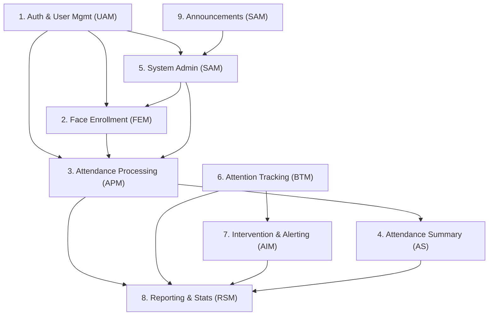

# Smart Attendance System — Comprehensive Project Audit Report

**Date:** 2026-06-18  
**Auditor:** Codebase review (updated from 2026-06-04 audit)  
**Source of Truth:** User stories in `docs/requirements_specification.md` + implemented codebase

> [!NOTE]
> This report reflects the **current implementation state** as of 2026-06-18. Planned features not yet built are documented in `docs/development_todo.md` and left unchanged there.

---

## 1. Project Module Analysis

### 1.1 Total Modules: **9**

| # | Module | Abbreviation | Purpose |
|---|--------|-------------|---------|
| 1 | Authentication & User Management | UAM | Login, logout, password reset, role management, profile pictures, student sign-up |
| 2 | Student Registration — Face Enrollment | FEM | Student data entry, webcam face capture, embedding generation, bulk upload, quality validation |
| 3 | Attendance Processing Module | APM | Real-time face detection, recognition via embeddings, auto-marking Present/Absent, manual overrides |
| 4 | Attendance Summary | AS | Filtered views, attendance percentages, CSV export, trend charts, poor attendance reports |
| 5 | System Administration | SAM-Admin | Course/subject management, DB backups, CI/CD, system health monitoring, RBAC, audit logs, SIS import |
| 6 | Behavioural Attention Tracking Model | BTM | Head pose analysis, real-time attention scores, posture/sleepiness detection, class engagement average |
| 7 | Academic Intervention & Alerting Module | AIM | Low engagement alerts, risk lists, custom thresholds, centralized alert log, notification config, heatmaps |
| 8 | Reporting & Statistical Summary Module | RSM | Real-time dashboards, engagement summaries, at-risk reports, CSV/PDF generation, heatmaps, student portal |
| 9 | Announcements / System Management | SAM | Course CRUD, backups, CI/CD pipelines, system health, RBAC, audit logs, SIS data import |

> [!NOTE]
> Modules 5 (System Administration) and 9 (Announcements/System Management) share nearly identical user stories (AS-01 through AS-06 vs SAM-01 through SAM-07). They are treated as partially overlapping modules below.

### 1.2 Module Dependencies

---

## 2. Completion Assessment

### 2.1 Module-Level Status

| Module | Status | Detail |
|--------|--------|--------|
| 1. Authentication & User Management (UAM) | 🟡 Partially Completed (~15%) | `auth.py` is empty. Frontend has `ProfilePage.jsx`, role-filtered sidebar, and `api.js` JWT interceptor. `ProtectedRoute` bypasses auth with mock admin user. No login/signup/reset pages. |
| 2. Face Enrollment (FEM) | 🟡 Partially Completed (~60%) | Full frontend: registration form, 15-sample guided webcam capture, bulk upload UI, searchable gallery, re-enroll flow. Backend `POST /attendance/enroll` with MediaPipe validation and mock embeddings. **Missing:** real model, DB, backend student routes. |
| 3. Attendance Processing (APM) | 🟡 Partially Completed (~45%) | `LiveClassroom.jsx`: webcam, canvas overlay, WebSocket client, manual override, session finalize. Backend `WS /attendance/ws/detect` with real detection, random matching. **Missing:** session API, real recognition, DB persistence, path alignment with frontend. |
| 4. Attendance Summary (AS) | 🟡 Partially Completed (~35%) | `ReportsLogs.jsx` shows session archives from `localStorage`, basic stats, course filter, trend bars. **Missing:** backend reports, real CSV export, poor attendance report, last-seen timestamps. |
| 5. System Administration (SAM-Admin) | ❌ Not Started | `SystemSettings.jsx` is a placeholder (1 line). |
| 6. Behavioural Attention Tracking (BTM) | ❌ Not Started | `AttentionAnalysis.jsx` is a placeholder (1 line). `ml/` directory is empty. |
| 7. Academic Intervention & Alerting (AIM) | ❌ Not Started | Sidebar links to `/dashboard/alerts` (route not defined). No alerting implementation. |
| 8. Reporting & Statistical Summary (RSM) | 🟡 Partially Completed (~25%) | `DashboardHome.jsx` and `ReportsLogs.jsx` show stats from `localStorage`. **Missing:** backend analytics, exports, student portal. |
| 9. Announcements / System Management | 🟡 Partially Completed (~15%) | `CourseDashboard.jsx` provides full course CRUD via `localStorage`. **Missing:** backend courses API, announcements, SIS import. |

### 2.2 User Story Coverage Detail

#### Module 1: Authentication & User Management (UAM)

| ID | Story Summary | Status |
|----|--------------|--------|
| UAM-01 | Teacher/admin login | ❌ Not Started |
| UAM-02 | Logout & session destroy | 🟡 Partial (sidebar clears `localStorage`; no backend) |
| UAM-03 | Instructor bio | 🟡 Partial (`ProfilePage.jsx` UI only) |
| UAM-04 | Password reset | ❌ Not Started |
| UAM-05 | Role management (RBAC) | 🟡 Partial (sidebar nav filtering with mock user) |
| UAM-06 | Student sign-up & login | ❌ Not Started |
| UAM-07 | Profile picture upload | 🟡 Partial (`ProfilePage.jsx` UI only) |

#### Module 2: Face Enrollment (FEM)

| ID | Story Summary | Status |
|----|--------------|--------|
| FEM-01 | Student basic info registration | ✅ Completed (frontend form with validation) |
| FEM-02 | Multi-angle webcam capture | 🟡 Partial (15-sample guided capture with angle prompts) |
| FEM-03 | Convert to 128-d embeddings | 🟡 Partial (backend mock embeddings; frontend simulates pipeline) |
| FEM-04 | Bulk photo upload (ZIP) | 🟡 Partial (UI with simulated processing) |
| FEM-05 | Enrolled student gallery | ✅ Completed (searchable datatable) |
| FEM-06 | Quality validation (blur/lighting) | 🟡 Partial (Laplacian blur in backend; simulated UI warnings) |
| FEM-07 | Re-enroll / update face data | 🟡 Partial (re-enroll button + query param flow; no audit log) |

#### Module 3: Attendance Processing (APM)

| ID | Story Summary | Status |
|----|--------------|--------|
| APM-01 | Real-time face detection with bounding boxes | 🟡 Partial (canvas overlay; WebSocket wired; offline fallback) |
| APM-02 | Face matching via embeddings | ❌ Not Started (backend random matching only) |
| APM-03 | Label unknowns | 🟡 Partial (UI shows Unknown labels; backend assigns randomly) |
| APM-04 | Auto-mark Present | 🟡 Partial (roster updated from WebSocket or local state) |
| APM-05 | Mark Absent at session close | 🟡 Partial (session saved to `localStorage`; no backend session API) |
| APM-06 | Manual override | ✅ Completed (toggle switch in frontend) |
| APM-07 | Optimized lightweight model | ❌ Not Started (no model optimization) |

#### Module 4: Attendance Summary (AS)

| ID | Story Summary | Status |
|----|--------------|--------|
| AS-01 | Filtered attendance summary | 🟡 Partial (search by session ID, no date/subject filter) |
| AS-02 | Student attendance percentage | 🟡 Partial (calculated in StudentManagement, not in dedicated view) |
| AS-03 | CSV export | ❌ Not Started (toast mock only) |
| AS-04 | Visual trend chart | 🟡 Partial (static hardcoded bar chart, no real data) |
| AS-05 | Poor attendance report (<75%) | ❌ Not Started |
| AS-06 | "Last Seen" timestamp | ❌ Not Started |

#### Module 5: System Administration — All 6 stories ❌ Not Started

#### Module 6: Behavioural Attention Tracking (BTM) — All 7 stories ❌ Not Started

#### Module 7: Academic Intervention & Alerting (AIM) — All 7 stories ❌ Not Started

#### Module 8: Reporting & Statistical Summary (RSM)

| ID | Story Summary | Status |
|----|--------------|--------|
| RSM-01 | Real-time attendance dashboard | 🟡 Partial (DashboardHome shows stats from localStorage) |
| RSM-02 | Engagement summary per class | ❌ Not Started |
| RSM-03 | Monthly at-risk report | ❌ Not Started |
| RSM-04 | Automated daily CSV/PDF | ❌ Not Started |
| RSM-05 | Heatmap of student focus | ❌ Not Started |
| RSM-06 | Periodic email summary | ❌ Not Started |
| RSM-07 | Student personal portal | ❌ Not Started |

#### Module 9: Announcements / System Management — All 7 stories ❌ Not Started

---

## 3. End-to-End Integration Verification

| Module | Status | Integrated? | End-to-End Working? | Notes |
|--------|--------|-------------|---------------------|-------|
| Auth & User Mgmt (UAM) | 🟡 Partial | ❌ No | ❌ No | Frontend shell only. `ProtectedRoute` bypasses auth with mock user. No backend auth. |
| Face Enrollment (FEM) | 🟡 Partial | 🟡 Partial | ❌ No | Frontend CRUD + capture works via `localStorage`. Backend enroll endpoint exists but path differs from frontend calls. |
| Attendance Processing (APM) | 🟡 Partial | 🟡 Partial | ❌ No | Frontend WebSocket client wired; backend endpoint at different path. Offline fallback when backend down. |
| Attendance Summary (AS) | 🟡 Partial | 🟡 Partial | ❌ No | Reports read from `localStorage`. Export is mock toast. |
| System Administration | ❌ Not Started | ❌ No | ❌ No | Placeholder page only. |
| Behavioural Attention Tracking (BTM) | ❌ Not Started | ❌ No | ❌ No | Placeholder page only. |
| Intervention & Alerting (AIM) | ❌ Not Started | ❌ No | ❌ No | No implementation. |
| Reporting & Stats (RSM) | 🟡 Partial | 🟡 Partial | ❌ No | Dashboard and reports from `localStorage`. |
| Announcements / System Mgmt | 🟡 Partial | ❌ No | ❌ No | Course CRUD in `CourseDashboard.jsx` (`localStorage` only). |

> [!CAUTION]
> **No single end-to-end flow is fully functional with backend persistence.** The frontend is API-ready with robust `localStorage` fallbacks. The backend has only 3 endpoints, and several frontend API paths do not match backend routes.

---

## 4. Gap Analysis

### 4.1 Modules Not Yet Developed (4 of 9)

1. **System Administration** — Placeholder only
2. **Behavioural Attention Tracking** — Placeholder only
3. **Academic Intervention & Alerting** — Zero implementation
4. **Authentication (backend)** — No JWT, no login API (frontend shell exists)

### 4.1b Modules with Frontend-Only Implementation

1. **Course Management (SAM-01)** — `CourseDashboard.jsx` via `localStorage`
2. **Auth UI shell (UAM)** — Profile page, sidebar, mock ProtectedRoute

### 4.2 Features Missing Inside Partially Completed Modules

| Module | Missing Features |
|--------|-----------------|
| Face Enrollment | Real FaceNet/ArcFace model integration, persistent DB storage, real-time quality feedback (currently simulated in UI), backend student routes aligned with frontend paths, re-enrollment audit history |
| Attendance Processing | Real face recognition (not random), embedding comparison engine, session management API at paths frontend expects, database persistence, unknown face security logging |
| Attendance Summary | Date/subject filtering, real CSV export, dynamic attendance percentages, poor attendance threshold report, "Last Seen" timestamp |
| Reporting & Stats | Engagement summaries, at-risk reports, automated file generation, student portal, focus heatmaps |

### 4.3 Critical Integration Tasks Pending

| Integration | Status |
|-------------|--------|
| Frontend ↔ Backend API | 🟡 Partial — frontend calls API with `localStorage` fallback; most endpoints missing; path mismatches on enroll and WebSocket |
| Backend ↔ Database | ❌ No database configured |
| Backend ↔ ML Model | 🟡 `ml_service.py` with MediaPipe detection; mock embeddings/matching |
| Authentication guard on routes | ❌ `ProtectedRoute` bypasses auth with mock user |
| WebSocket real-time pipeline | 🟡 Frontend client wired; backend at different path (`/attendance/ws/detect` vs `/sessions/{id}/detect`) |
| Reporting ↔ Database queries | ❌ Reports read from `localStorage` |
| CI/CD pipeline | ❌ No Docker/CI files (empty stubs) |

### 4.4 High-Priority Items Before Deployment

1. **Database layer** — No database exists at all
2. **Authentication & Authorization** — No protection on any route
3. **Real face recognition model** — All detection/matching is mocked
4. **Frontend-Backend integration** — Frontend is fully disconnected from backend
5. **Data persistence** — All data lives in browser localStorage

### 4.5 Summary Counts

| Metric | Count |
|--------|-------|
| **Total Modules** | 9 |
| **Fully Completed** | 0 |
| **Partially Completed** | 5 (UAM shell, FEM, APM, AS, RSM) + 1 frontend-only (SAM courses) |
| **Not Started** | 4 (SAM-Admin, BTM, AIM, backend auth) |
| **Total User Stories** | 55 |
| **Completed Stories** | 3 (FEM-01, FEM-05, APM-06) |
| **Partially Completed Stories** | 17 |
| **Not Started Stories** | 35 |
| **Estimated Development Phases Remaining** | 5–6 major phases |

---

## 5. Deployment Readiness Assessment

| Criterion | Ready? | Detail |
|-----------|--------|--------|
| Authentication | ❌ | No auth system |
| Database | ❌ | No database configured or connected |
| API completeness | ❌ | 2 endpoints exist; ~20+ needed |
| Frontend-backend integration | 🟡 Partial | Frontend API-ready with fallback; path mismatches; most endpoints missing |
| ML model deployment | ❌ | Mock embeddings; no real model |
| Infrastructure | ❌ | Docker/K8s files are empty stubs |
| Testing | ❌ | Test directories exist but contain no tests |
| Security | ❌ | CORS allows `*`, no auth, no RBAC |
| Monitoring | ❌ | No system health monitoring |

> [!CAUTION]
> **Deployment Readiness: NOT READY.** The project is at a **prototype/UI-scaffold stage** (~20–25% overall completion). The frontend demonstrates full UI flows with `localStorage` persistence. The backend has 3 endpoints with mock ML. No database, no real auth, and no deployment infrastructure.

---

## 6. Development Roadmap (Estimated Phases)

### Phase 1: Foundation (High Priority)
- Database setup (PostgreSQL/MongoDB) with ORM models
- Authentication system (JWT-based login/logout/password reset)
- RBAC middleware
- Backend config and environment management

### Phase 2: Core ML Pipeline
- Integrate real face recognition model (FaceNet/ArcFace/MobileFaceNet)
- Embedding generation and persistent storage
- Face detection optimization for CPU
- WebSocket real-time frame processing pipeline

### Phase 3: Attendance System
- Connect frontend to backend APIs
- Session management (create, close, roster)
- Real attendance marking with DB persistence
- CSV/PDF export functionality

### Phase 4: Attention Tracking & Alerting
- Head pose estimation model
- Real-time attention scoring
- Alert system with configurable thresholds
- Risk list generation

### Phase 5: Reporting & Administration
- Comprehensive reporting dashboards
- Student personal portal
- System administration panel
- Automated report generation
- Backup/restore functionality

### Phase 6: Deployment & QA
- Docker containerization
- CI/CD pipeline
- End-to-end testing
- Security audit
- Performance optimization
