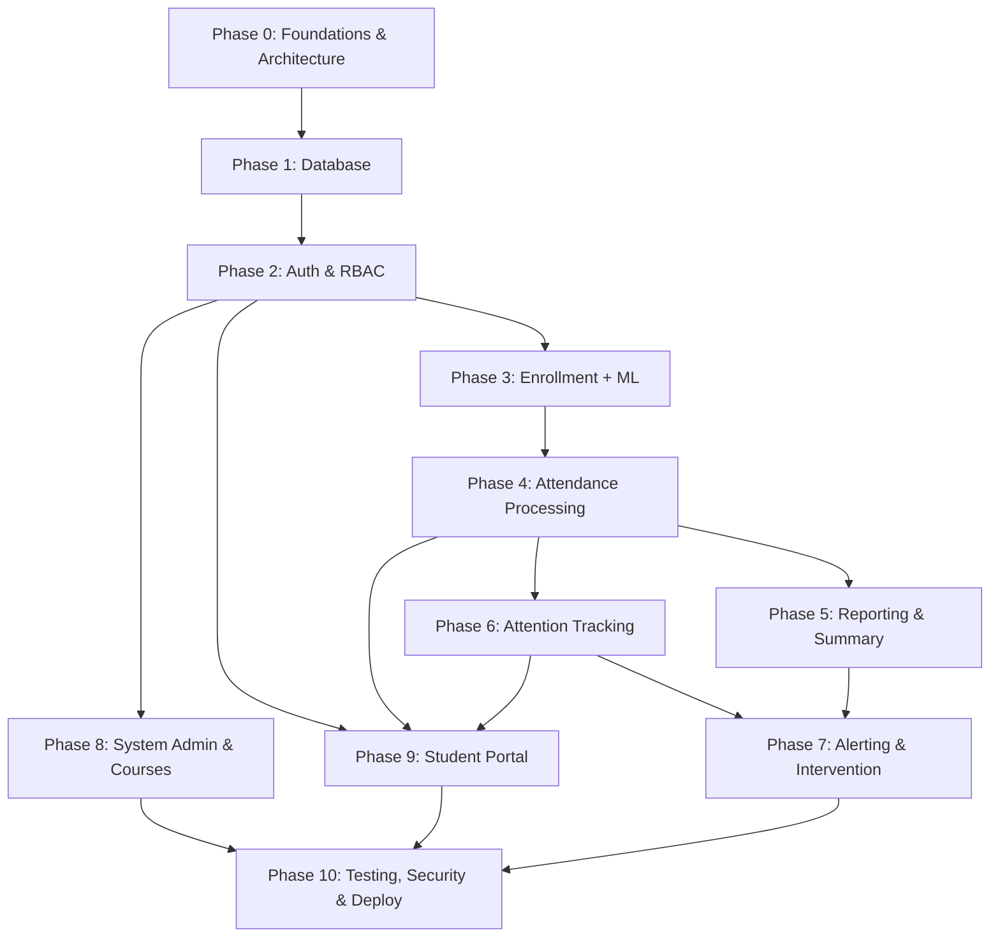

# Implementation Plan — Overview & Index

> **Document type:** Phased implementation roadmap (master index)
> **Last updated:** 2026-06-18
> **Baseline state:** ~20–25% complete (see [`project-current-state.md`](project-current-state.md))
> **Source of scope:** [`work-breakdown-structure.md`](work-breakdown-structure.md)
> **Aligned with:** [`../docs/development_todo.md`](../docs/development_todo.md), [`../docs/requirements_specification.md`](../docs/requirements_specification.md), [`../docs/api_design.md`](../docs/api_design.md)

---

## 1. Purpose

This is the master index for the phase-wise implementation plan of the Smart Attendance System. Each phase lives in its own file in this `planning/` folder. Every phase is:

- **Scoped from** the Work Breakdown Structure (WBS) sections.
- **Grounded in** the actual repository state documented in `project-current-state.md` (what is already built, partial, or missing).
- **Traceable to** the 55 user stories and the existing `Phase 1 … Phase 10` numbering used across `docs/development_todo.md` and the requirements traceability matrix.
- **Sequenced** so each phase consumes only what earlier phases deliver (no forward dependencies).

> **Numbering note:** Phases 1–10 deliberately match the phase numbers already used in `docs/development_todo.md` and the story→phase traceability matrix, so existing references stay valid. **Phase 0** is added for the foundational prerequisites (dev environment, backend skeleton, frontend cleanup, architecture/design docs) that the WBS calls out but that are not yet started in the codebase.

---

## 2. Phase Index

| Phase | File | Focus | WBS Coverage | Priority |
|-------|------|-------|--------------|----------|
| **0** | [`phase-00-foundations-and-architecture.md`](phase-00-foundations-and-architecture.md) | Governance, standards, dev environment, backend skeleton, frontend cleanup, architecture & design docs | 1.0, 2.0, 3.1, 3.2, 3.4 | 🔴 Critical |
| **1** | [`phase-01-database-and-persistence.md`](phase-01-database-and-persistence.md) | PostgreSQL, async SQLAlchemy, ORM models, Alembic, seed | 3.3 | 🔴 Critical |
| **2** | [`phase-02-authentication-and-user-management.md`](phase-02-authentication-and-user-management.md) | JWT auth, RBAC, login/signup/reset, real `ProtectedRoute` | 4.0 | 🔴 Critical |
| **3** | [`phase-03-face-enrollment-and-recognition.md`](phase-03-face-enrollment-and-recognition.md) | Real embeddings, student API, ML encoder/matcher, enrollment E2E | 5.0, 6.0 | 🔴 Critical |
| **4** | [`phase-04-attendance-processing.md`](phase-04-attendance-processing.md) | Sessions, real-time recognition WebSocket, attendance records | 7.0 | 🔴 Critical |
| **5** | [`phase-05-reporting-and-summary.md`](phase-05-reporting-and-summary.md) | Attendance summaries, at-risk, trends, CSV/PDF export, dashboard wiring | 8.0, 11.0 (partial) | 🟡 High |
| **6** | [`phase-06-attention-tracking.md`](phase-06-attention-tracking.md) | Head pose, attention scoring, posture, attention UI | 9.0 | 🟡 High |
| **7** | [`phase-07-alerting-and-intervention.md`](phase-07-alerting-and-intervention.md) | Alerts, risk lists, thresholds, correlation, heatmap | 10.0, 11.0 (partial) | 🟡 High |
| **8** | [`phase-08-system-admin-and-courses.md`](phase-08-system-admin-and-courses.md) | Course API, system health, backup, audit log, SIS import, settings UI | 13.0, 11.0 (RSM-06) | 🟢 Medium |
| **9** | [`phase-09-student-portal.md`](phase-09-student-portal.md) | Student self-service portal + role routing | 12.0 | 🟢 Medium |
| **10** | [`phase-10-testing-security-deployment.md`](phase-10-testing-security-deployment.md) | Tests, security hardening, Docker/CI, docs, closure | 14.0, 15.0, 16.0, 17.0, 18.0 | 🟢 Medium |

---

## 3. Sequencing & Dependency Graph

**Hard-sequential spine:** Phase 0 → 1 → 2 → 3 → 4. Nothing real persists, authenticates, or recognizes faces until this spine is complete.

**Parallelizable after the spine:**
- Phase 5 (Reporting) starts once Phase 4 produces DB-backed attendance.
- Phase 6 (Attention) starts once Phase 4's WebSocket pipeline exists (it extends the same pipeline).
- Phase 8 (Courses/Admin) backend can start right after Phase 2 (only needs DB + auth); its course API is also a soft dependency for Phases 4 and 5.
- Phase 7 (Alerting) needs both Phase 5 (attendance %) and Phase 6 (attention) data.
- Phase 9 (Student Portal) needs auth (P2) + attendance (P4) + attention (P6).
- Phase 10 runs continuously but finalizes last.

> **Course API ordering note:** Phase 4 sessions and Phase 5 reports reference courses and rosters. The Course model is created in **Phase 1**; its full CRUD **API/UI** is scheduled in **Phase 8** to match `docs/development_todo.md`. Where Phase 4/5 need course data before Phase 8, they use the model + a minimal read query, and the full management surface is completed in Phase 8. This is the one intentional soft cross-reference and is called out in both phase files.

---

## 4. Story Coverage Map (55 user stories)

Coverage mirrors the traceability matrix in `docs/development_todo.md`.

| Module | Stories | Primary Phase(s) |
|--------|---------|------------------|
| UAM (Auth & Users) | UAM-01…07, SA-02, SAM-05 | Phase 2 |
| FEM (Face Enrollment) | FEM-01…07 | Phase 3 (FEM-01, FEM-05 already done) |
| APM (Attendance) | APM-01…07 | Phase 3 (APM-07 optimization), Phase 4 |
| AS (Summary) | AS-01…06 | Phase 5 |
| RSM (Reporting) | RSM-01…07 | Phase 5 (01,03,04), Phase 7 (02,05), Phase 8 (06), Phase 9 (07) |
| BTM (Attention) | BTM-01…07 | Phase 6 |
| AIM (Alerting) | AIM-01…07 | Phase 7 |
| SA (SysAdmin) | SA-01,03,04,05 | Phase 8 (SA-06 → Phase 10) |
| SAM (Course/Admin) | SAM-01,02,04,06,07 | Phase 8 (SAM-03 → Phase 10) |

**Already complete (3):** FEM-01, FEM-05, APM-06 (these are validated/hardened, not rebuilt).

---

## 5. How Each Phase File Is Structured

Every `phase-NN-*.md` file follows the same template so they read consistently and align:

1. **Header** — objective, WBS coverage, user stories, priority, estimated effort, dependencies.
2. **Entry state (baseline)** — exactly what exists today per `project-current-state.md`, so work starts from reality, not a blank slate.
3. **Tasks** — grouped by ML / Backend / Frontend / Infra. Each task carries: WBS ref, target file path, user-story tag, and whether it is *new*, *replace-mock*, or *wire-existing-UI*.
4. **Contract alignment** — the specific frontend↔backend path/shape mismatches this phase resolves (from `project-current-state.md` §5.8, §6.4).
5. **Deliverables & acceptance criteria** — testable outcomes.
6. **Exit criteria / Definition of Done** — what must be true to start the next phase.
7. **Alignment notes** — what this phase consumes from prior phases and unblocks for later ones.

---

## 6. Cross-Phase Conventions (apply to all phases)

These conventions are established in Phase 0 and are non-negotiable for every later phase:

- **API base path:** all endpoints under `/api/v1`. Aggregated in `backend/app/api/v1/router.py`, mounted in `backend/app/main.py`.
- **Route alignment:** backend route paths must match what the frontend already calls (resolve `/attendance/enroll` → `/students/{id}/enroll-face` and `/ws/detect` → `/sessions/{id}/detect`). See each phase's "Contract alignment" section.
- **Response envelope:** standard `{ "status", "data"|"message", "errors" }` shape and a shared error model (defined Phase 0, used everywhere).
- **Auth:** after Phase 2, every non-public route uses `Depends(get_current_user)` and, where relevant, `require_role(...)`. Roles: `admin`, `teacher`, `counselor`, `student`.
- **`localStorage` retirement:** each frontend wiring task removes the corresponding `localStorage` fallback **only after** the backend route is verified, to preserve the working demo until the last possible moment.
- **Stack reality:** frontend is **React 19 + Vite 8 + plain JSX** (not Next.js/TS). The conflicting `non-negociable-cursor-reqs.md` is reconciled in Phase 0 (WBS 1.3.3); do not introduce TypeScript/Next.js.
- **Progress tracking:** after each completed task, update `agent.md` and tick the matching item in `docs/development_todo.md` (repo rule).

---

## 7. Estimated Effort Summary

| Phase | Est. Days | Notes |
|-------|-----------|-------|
| 0 | 3–4 | Setup + docs; partly parallelizable with Phase 1 |
| 1 | 2–3 | Foundation for all backend |
| 2 | 3–4 | Critical path |
| 3 | 4–5 | Includes real ML model integration |
| 4 | 4–5 | Real-time pipeline |
| 5 | 4–5 | Can overlap with 6 |
| 6 | 5–7 | ML-heavy |
| 7 | 5–6 | Depends on 5 + 6 |
| 8 | 4–5 | Can start after 2 |
| 9 | 2–3 | Small |
| 10 | 3–5 | Continuous + final |
| **Total** | **~39–52 dev-days** | Aligns with the ~36–48 estimate in project docs (+ Phase 0) |

---

*This overview should be updated whenever a phase's scope or sequencing changes. After each milestone, also update `agent.md` and `project-current-state.md`.*
