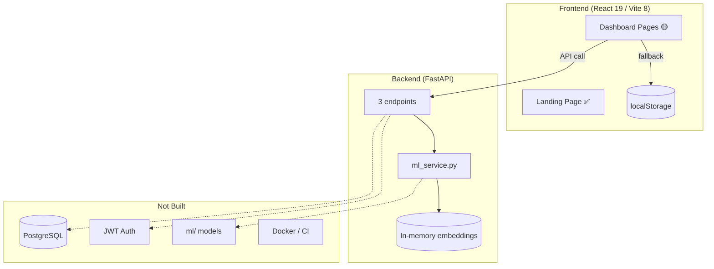

# Smart Attendance System — Project Current State

> **Document type:** Implementation snapshot  
> **Last updated:** 2026-06-18  
> **Overall completion:** ~20–25%  
> **Related docs:** [`docs/project_audit_report.md`](../docs/project_audit_report.md), [`docs/requirements_specification.md`](../docs/requirements_specification.md), [`agent.md`](../agent.md), [`planning/work-breakdown-structure.md`](work-breakdown-structure.md)

---

## 1. Executive Summary

This repository is a **Final Year Project (FYP)** for a CCTV-based smart attendance platform. The intended product automates attendance via facial recognition, tracks student attention/focus, and lays groundwork for future exam monitoring.

**Current reality:** The project is a **frontend-heavy UI prototype** with a minimal backend skeleton. Most user-facing flows work in the browser via `localStorage` fallbacks. There is no production database, no real authentication, no persistent server-side data, and no real face recognition model. The core product — automated recognition, secure multi-user access, and analytics — is largely unbuilt.

| Dimension | State |
|-----------|-------|
| Frontend UI/UX | Substantial (~60–70% of UI screens built) |
| Backend API | Minimal (3 endpoints) |
| Database | Not started |
| Authentication | Not started (mock bypass only) |
| ML / Recognition | Partial (detection only; matching mocked) |
| Infrastructure / Tests | Not started |
| Documentation / Planning | Strong |

**User story scorecard** (from `docs/requirements_specification.md`):

| Metric | Count |
|--------|-------|
| Total user stories | 55 |
| Fully completed | 3 |
| Partially completed | 17 |
| Not started | 35 |

**Verdict:** Prototype / demo stage — **not deployable** to production.

---

## 2. Project Vision vs. Current Delivery

| Planned capability | Current delivery |
|--------------------|------------------|
| CCTV + CNN facial recognition for attendance | MediaPipe face **detection** only; recognition is random/mock |
| Attention and focus level estimation | Placeholder page only; no ML |
| Multi-role access (admin, teacher, counselor, student) | Mock admin user injected; sidebar role filtering UI only |
| Persistent attendance records | Browser `localStorage` only |
| Real-time classroom detection pipeline | Frontend WebSocket client wired; backend path mismatch; offline fallback |
| Reporting, exports, at-risk analytics | UI shells; export is mock toast; no backend queries |
| System administration | Placeholder page only |
| Exam monitoring (future scope) | Not started |

---

## 3. Repository Structure

```
smart-attendance-system/
├── frontend/              ✅ Primary working area (React 19 + Vite 8)
├── backend/               🟡 Skeleton (FastAPI, 3 endpoints)
├── ml/                    ❌ Empty directory
├── docs/                  ✅ Specs, audit, API design, roadmap
├── planning/              ✅ WBS and this document
├── infra/                 ❌ README only
├── scripts/               ❌ README only
├── tests/                 ❌ README only
├── agent.md               📝 Live agent progress notes
├── non-negociable-cursor-reqs.md  ⚠️ Specifies Next.js/TS — not what is built
├── README.md              ✅ Overview + expected API contract
└── LICENSE
```

### Not present (despite earlier README mentions or planned structure)

| Expected | Status |
|----------|--------|
| `data/` (datasets) | Does not exist |
| `ml/` implementation | Directory empty |
| Docker / K8s manifests | Empty 0-byte stubs or missing files |
| CI pipelines | None |
| Automated tests | None |
| Auth pages (`frontend/src/pages/auth/`) | Directory does not exist |

---

## 4. Technology Stack

### 4.1 Actual vs. documented

| Layer | Documented / planned | Actually implemented |
|-------|--------------------|-----------------------|
| **Frontend** | React / Vite (`README.md`) | React **19.2.4** + Vite **8** + Tailwind **3** + React Router **7** |
| **Frontend (alt spec)** | Next.js + TypeScript (`non-negociable-cursor-reqs.md`) | **Not followed** — plain JSX, no TypeScript |
| **Backend** | FastAPI + PostgreSQL + SQLAlchemy | **FastAPI only** — no DB, no ORM usage |
| **ML** | FaceNet / ArcFace, attention models | MediaPipe in `ml_service.py`; embeddings random |
| **Auth** | JWT + RBAC | Not implemented |
| **Infra** | Docker, K8s, CI | Empty stubs / README placeholders |

### 4.2 Frontend dependencies (`frontend/package.json`)

| Package | Purpose |
|---------|---------|
| `react`, `react-dom` | UI framework |
| `react-router-dom` | Client-side routing |
| `axios` | HTTP API client |
| `react-webcam` | Camera capture (enrollment, live classroom) |
| `react-hot-toast` | Notifications |
| `recharts` | Charts (reports page — partially used) |
| `lucide-react` | Icons |
| `tailwindcss` | Styling |

### 4.3 Backend dependencies (`backend/requirements.txt`)

**Listed but not wired into running code:** SQLAlchemy, asyncpg, Alembic, python-jose, passlib, torch, facenet-pytorch, reportlab, fastapi-mail, etc.

**Actively used:** FastAPI, uvicorn, pydantic, websockets, opencv-python-headless, mediapipe, numpy.

---

## 5. Frontend — Detailed State

### 5.1 Architecture pattern

All dashboard pages follow an **API-first with `localStorage` fallback** pattern:

1. Attempt REST/WebSocket call via `frontend/src/services/api.js`
2. On failure, read/write browser `localStorage`
3. UI remains functional for demos without a running backend

The API client attaches a JWT from `smart_attendance_token` and redirects to `/login` on 401 — but `/login` is not implemented, and auth is bypassed anyway.

### 5.2 Routing (`frontend/src/App.jsx`)

| Route | Component | Status |
|-------|-----------|--------|
| `/` | `LandingPage` | ✅ Complete |
| `/dashboard` | `DashboardHome` | 🟡 UI complete; `localStorage` only |
| `/dashboard/students` | `StudentManagement` | 🟡 API + `localStorage` fallback |
| `/dashboard/enrollment` | `FaceEnrollment` | 🟡 API + `localStorage` fallback |
| `/dashboard/courses` | `CourseDashboard` | 🟡 `localStorage` only |
| `/dashboard/live` | `LiveClassroom` | 🟡 WebSocket/API + offline fallback |
| `/dashboard/reports` | `ReportsLogs` | 🟡 `localStorage`; mock export |
| `/dashboard/profile` | `ProfilePage` | 🟡 `/auth/me` + mock user fallback |
| `/dashboard/attention` | `AttentionAnalysis` | ❌ Placeholder (one line) |
| `/dashboard/settings` | `SystemSettings` | ❌ Placeholder (one line) |
| `/login`, `/signup`, `/forgot-password` | — | ❌ Commented out; pages do not exist |

### 5.3 Landing page — ✅ Complete

Polished marketing site at `/` composed of sections in `frontend/src/components/landing/`:

- Hero, Problem, How It Works, AI Features, Scope, Significance, Stakeholders, Deliverables, CTA, Footer
- Scroll-reveal hook (`useScrollReveal`)
- Wavy background animation

**Technical debt:** Duplicate section files exist under `frontend/src/pages/landing/` and `frontend/src/components/landing/`. Only `components/landing/` is imported by `LandingPage.jsx`.

### 5.4 Dashboard shell — ✅ Complete

| Component | File | Notes |
|-----------|------|-------|
| Layout | `DashboardLayout.jsx` | Sidebar + topbar wrapper |
| Sidebar | `Sidebar.jsx` | Role-filtered nav, logout, user display |
| Topbar | `Topbar.jsx` | Header bar |
| UI kit | `components/ui/*` | Button, Card, Input, Badge, Tabs, Select, PageHeader |

### 5.5 Page-by-page implementation

#### `DashboardHome.jsx` — 🟡 UI only

- Reads `smart_attendance_enrolled_students`, `smart_attendance_courses`, `smart_attendance_session_logs` from `localStorage`
- Displays stat cards, recent sessions, schedule, system integrity widgets
- Does **not** call backend APIs
- Some stats use hardcoded fallbacks (e.g. 85% avg attendance when no logs)

#### `StudentManagement.jsx` — 🟡 API-ready

- Full CRUD UI: add student modal, search, filter, delete, bulk CSV import
- Attempts parallel fetch: `GET /students`, `GET /courses`, `GET /sessions`
- Falls back to `localStorage` on API failure
- Computes attendance % from local session logs
- Re-enroll navigates to `/dashboard/enrollment?student={id}`

#### `FaceEnrollment.jsx` — 🟡 API-ready

- Two tabs: Webcam Capture, Bulk Upload
- Registration form → guided 15-sample webcam capture
- Student searchable gallery with embedding status badges
- Re-enroll via `?student=` query parameter
- Calls `POST /students/{id}/enroll` (path differs from backend)
- Simulated enrollment pipeline delays and quality-check toasts before API call
- Bulk upload UI with simulated processing states

#### `WebcamCapture.jsx` — 🟡 Partial

- 15-sample capture with angle guidance prompts (front, left, right, up, down, etc.)
- Quality warnings ("Low Lighting", "Motion Blur", "Face not centered") are **simulated** via random interval — not real CV
- Face detection on capture uses `Math.random()` success rate — not real detection

#### `CourseDashboard.jsx` — 🟡 localStorage only

- Full course CRUD: grid/list views, add/edit/delete modals, search
- Default seed data if `localStorage` empty
- Persists to `smart_attendance_courses`
- No API integration

#### `LiveClassroom.jsx` — 🟡 API-ready

- Webcam feed + HTML5 canvas bounding-box overlay
- On mount: loads roster via `GET /students` (fallback: `localStorage`)
- Starts session via `POST /sessions`; connects WebSocket to `ws://localhost:8000/api/v1/sessions/{dbId}/detect`
- Sends frames as `{ type: "frame", image: base64 }` at ~5 FPS when connected
- Manual override toggle calls `PUT /attendance/{record_id}` with local state update
- Session end calls `PUT /sessions/{id}/close`; always saves to `smart_attendance_session_logs`
- **Offline mode:** on API/WebSocket failure, camera runs without detection overlay

#### `ReportsLogs.jsx` — 🟡 localStorage only

- Session archive from `smart_attendance_session_logs`
- Global analytics cards, course filter, search, session detail overlay
- Hardcoded trend bar chart data
- Export buttons trigger mock `toast.promise` — no file download

#### `ProfilePage.jsx` — 🟡 API-ready shell

- Fetches `GET /auth/me`; falls back to `smart_attendance_user`
- Edit name/bio via `PUT /auth/me`
- Avatar upload via `PUT /auth/me/avatar` (multipart)
- No backend to persist changes

#### `AttentionAnalysis.jsx` — ❌ Placeholder

```jsx
export default function AttentionAnalysis() {
  return <div className="p-6">Attention Analysis Placeholder</div>;
}
```

#### `SystemSettings.jsx` — ❌ Placeholder

```jsx
export default function SystemSettings() { return <div className="p-6">System Settings Placeholder</div>; }
```

### 5.6 Authentication — ❌ Not implemented

| Expected | Actual |
|----------|--------|
| Login / signup / reset pages | Routes commented out; no `pages/auth/` directory |
| JWT-protected routes | `ProtectedRoute` injects mock admin and allows all access |
| Role enforcement | Sidebar filters nav by role from mock user object only |

`ProtectedRoute.jsx` behaviour:

- Injects `smart_attendance_user` (Demo Admin, `admin@school.edu`, role `admin`)
- Injects `smart_attendance_token` = `temporary_mock_token`
- Unconditionally renders `<Outlet />`

Comment in `App.jsx`: *"Auth pages disabled temporarily while being built by another developer."*

### 5.7 Sidebar broken links

`Sidebar.jsx` links to routes **not defined** in `App.jsx`:

| Link | Route | Status |
|------|-------|--------|
| Attendance | `/dashboard/attendance` | ❌ 404 → redirects to `/` |
| Alerts | `/dashboard/alerts` | ❌ 404 → redirects to `/` |

Logout navigates to `/login` which does not exist.

### 5.8 Frontend API calls expected

Base URL: `http://localhost:8000/api/v1` (via `VITE_API_URL` or default)

| Endpoint | Used by | Backend exists? |
|----------|---------|-----------------|
| `GET /students` | StudentManagement, FaceEnrollment, LiveClassroom | ❌ |
| `POST /students` | StudentManagement | ❌ |
| `DELETE /students/{id}` | StudentManagement | ❌ |
| `POST /students/bulk-import` | StudentManagement | ❌ |
| `POST /students/{id}/enroll` | FaceEnrollment | ❌ (backend has `/attendance/enroll`) |
| `POST /students/bulk-enroll` | FaceEnrollment | ❌ |
| `GET /courses` | StudentManagement | ❌ |
| `GET /sessions` | StudentManagement | ❌ |
| `POST /sessions` | LiveClassroom | ❌ |
| `PUT /sessions/{id}/close` | LiveClassroom | ❌ |
| `PUT /attendance/{record_id}` | LiveClassroom | ❌ |
| `WS /sessions/{id}/detect` | LiveClassroom | ❌ (backend has `/attendance/ws/detect`) |
| `GET /auth/me` | ProfilePage | ❌ |
| `PUT /auth/me` | ProfilePage | ❌ |
| `PUT /auth/me/avatar` | ProfilePage | ❌ |

---

## 6. Backend — Detailed State

### 6.1 Files with implementation

| File | Lines (approx.) | Purpose |
|------|-----------------|---------|
| `backend/app/main.py` | 26 | FastAPI app, CORS `allow_origins=["*"]`, mounts attendance router |
| `backend/app/api/v1/attendance.py` | 42 | Enroll + WebSocket routes |
| `backend/app/services/ml_service.py` | 132 | CV processing, mock embeddings |

### 6.2 Working endpoints (3 total)

#### `GET /`

```json
{ "message": "Welcome to Smart Attendance API" }
```

#### `POST /api/v1/attendance/enroll`

| Aspect | Detail |
|--------|--------|
| Request | `{ "studentId": "STU-1001", "images": ["base64...", ...] }` |
| Validation | Laplacian blur check; MediaPipe single-face detection |
| Preprocessing | Resize 160×160, normalize |
| Embedding | **Mock** — `np.random.rand(128)` |
| Storage | In-memory dict `student_embeddings` — lost on restart |
| Minimum | 10 valid images required |

#### `WebSocket /api/v1/attendance/ws/detect`

| Aspect | Detail |
|--------|--------|
| Input | Base64 JPEG frame as text message |
| Detection | MediaPipe — real bounding boxes as percentages |
| Recognition | **Random** — fake `studentId`, random Present/Unknown |
| Response | `{ "status": "success", "faces": [...] }` |

### 6.3 Empty scaffolding (0-byte stub files)

```
backend/app/config.py
backend/app/api/dependencies.py
backend/app/api/v1/auth.py
backend/app/api/v1/router.py
backend/app/api/v1/tasks.py
backend/app/models/__init__.py
backend/app/schemas/__init__.py
backend/app/middleware/__init__.py
backend/app/integrations/__init__.py
backend/app/utils/__init__.py
backend/tests/conftest.py
backend/docs/schema.md
backend/docs/public-routes.md
backend/Dockerfile
backend/pyproject.toml
backend/poetry.lock
```

Directory structure exists; implementation does not.

### 6.4 Frontend ↔ backend contract mismatches

| Frontend expects | Backend provides |
|------------------|------------------|
| `POST /api/v1/students/{id}/enroll` | `POST /api/v1/attendance/enroll` |
| `WS /api/v1/sessions/{id}/detect` | `WS /api/v1/attendance/ws/detect` |
| Frame message `{ type: "frame", image: "..." }` | Backend reads raw text (works if JSON parsed server-side — currently receives text directly) |
| `/auth/*`, `/students`, `/courses`, `/sessions`, `/reports` | None |

Even with backend running, **most frontend calls fail** and fall back to `localStorage`.

### 6.5 Security posture (backend)

| Issue | Detail |
|-------|--------|
| CORS | `allow_origins=["*"]` |
| Authentication | None on any endpoint |
| Authorization / RBAC | None |
| Input validation | Minimal (dict-based enroll payload) |

---

## 7. ML Module — Detailed State

### 7.1 `ml/` directory

**Empty.** No training scripts, models, requirements, or inference package.

### 7.2 `backend/app/services/ml_service.py`

| Capability | Real or mock |
|------------|--------------|
| Base64 image decode | ✅ Real |
| Laplacian blur detection | ✅ Real |
| MediaPipe face detection (enrollment) | ✅ Real — single-face validation |
| MediaPipe face detection (live frames) | ✅ Real — bounding boxes |
| Face preprocessing (resize, normalize) | ✅ Real |
| Embedding generation | ❌ Mock — `np.random.rand(128)` |
| Embedding storage | ❌ In-memory Python dict |
| Student matching (live) | ❌ Random `studentId` and status |
| FaceNet / ArcFace / MobileFaceNet | ❌ Not integrated |
| Head pose / attention models | ❌ Not started |
| ONNX optimization | ❌ Not started |

---

## 8. Infrastructure, Tests & Scripts

| Area | Path | State |
|------|------|-------|
| Docker | `infra/docker/` | Directory may exist; no working Dockerfiles |
| Kubernetes | `infra/k8s/` | Empty |
| CI/CD | `infra/ci/` | Empty |
| Monitoring | `infra/monitoring/` | Not populated |
| E2E tests | `tests/e2e/` | Empty |
| Load tests | `tests/load_tests/` | Empty |
| Security tests | `tests/security_tests/` | Empty |
| Dev scripts | `scripts/` | README only |
| Backend Dockerfile | `backend/Dockerfile` | 0 bytes |

---

## 9. Documentation Inventory

Documentation was synchronized with implementation state on **2026-06-18**. Planned-but-unbuilt content was left unchanged in roadmap/spec files.

| Document | Role | Accuracy |
|----------|------|----------|
| `README.md` | Top-level overview + API contract | ✅ Updated |
| `agent.md` | Agent progress snapshot | ✅ Updated |
| `frontend/README.md` | Frontend routes, stack, localStorage keys | ✅ Updated |
| `backend/README.md` | Backend endpoints and stubs | ✅ Updated |
| `docs/README.md` | Doc index | ✅ Updated |
| `docs/requirements_specification.md` | 55 user stories with status | ✅ Updated (3 done, 17 partial, 35 pending) |
| `docs/development_todo.md` | 10-phase roadmap | ✅ Updated task checkmarks |
| `docs/project_audit_report.md` | Module audit | ✅ Updated |
| `docs/api_design.md` | Implemented vs. to-build endpoints | ✅ Updated |
| `docs/apm_implementation_plan.md` | APM architecture + current status | ✅ Updated |
| `planning/work-breakdown-structure.md` | Full WBS | ✅ Current |
| `non-negociable-cursor-reqs.md` | Engineering spec (Next.js/TS) | ⚠️ Conflicts with actual React/Vite stack |

### Not yet authored

- `docs/project_overview.md`
- `docs/system_architecture.md`
- `docs/ml_design.md`
- `docs/ui_ux_design.md`
- `docs/deployment_guide.md`
- `docs/testing_strategy.md`
- `backend/docs/schema.md` (empty stub)

---

## 10. Module-by-Module Status (9 Modules)

| # | Module | Completion | Implemented | Missing |
|---|--------|------------|-------------|---------|
| 1 | Auth & User Management (UAM) | ~15% | API client, ProfilePage UI, mock ProtectedRoute, sidebar role nav | Login/signup/reset, JWT backend, real RBAC |
| 2 | Face Enrollment (FEM) | ~60% | Registration form, 15-sample webcam UI, gallery, bulk upload UI, re-enroll flow, backend enroll endpoint | Real embeddings, DB, student REST routes, real quality feedback |
| 3 | Attendance Processing (APM) | ~45% | LiveClassroom UI, manual override, session finalize, WebSocket client, backend detect WS | Real recognition, session API, DB, path alignment |
| 4 | Attendance Summary (AS) | ~35% | Reports UI, session logs, basic stats, course filter | Backend reports, CSV/PDF export, at-risk report, last-seen |
| 5 | System Administration | ~0% | Placeholder page | Health, backup, RBAC panel, audit logs, SIS import |
| 6 | Attention Tracking (BTM) | ~0% | Placeholder page | Head pose, attention scoring, ML models |
| 7 | Intervention & Alerting (AIM) | ~0% | Sidebar link only (broken route) | Alerts, risk lists, thresholds, heatmaps |
| 8 | Reporting & Stats (RSM) | ~25% | Dashboard cards, reports archive | Backend analytics, exports, student portal |
| 9 | Course Management (SAM) | ~15% | CourseDashboard CRUD via localStorage | Backend courses API, announcements |

### Fully completed user stories (3)

| ID | Story |
|----|-------|
| FEM-01 | Student basic info registration (frontend form) |
| FEM-05 | Enrolled student gallery (searchable datatable) |
| APM-06 | Manual attendance override toggle |

---

## 11. Data Persistence Model

### 11.1 Browser `localStorage` (primary data store today)

| Key | Contents | Written by |
|-----|----------|------------|
| `smart_attendance_enrolled_students` | Student records + embedding status | StudentManagement, FaceEnrollment, StudentRegistrationForm |
| `smart_attendance_courses` | Course list with slots, instructor, stats | CourseDashboard |
| `smart_attendance_session_logs` | Completed session snapshots (roster, stats, times) | LiveClassroom |
| `smart_attendance_user` | Mock/current user profile | ProtectedRoute, ProfilePage, Sidebar |
| `smart_attendance_token` | Mock JWT string | ProtectedRoute, api.js |

**Implications:**

- Data is per-browser, not shared across devices or users
- Clearing browser storage wipes all records
- No server-side backup or audit trail

### 11.2 Backend in-memory storage

| Store | Contents | Lifetime |
|-------|----------|----------|
| `MLService.student_embeddings` | Mock 128-d vectors per student ID | Process lifetime — lost on restart |

---

## 12. End-to-End Flow Assessment

| Flow | Works? | How it works today |
|------|--------|-------------------|
| Browse landing page | ✅ | Static React UI |
| Access dashboard without login | ✅ | Auth bypassed via mock user |
| Register student + capture faces | 🟡 | UI complete; data in `localStorage` |
| Bulk import students (CSV) | 🟡 | UI + simulated processing; `localStorage` |
| Manage courses | 🟡 | Full CRUD in `localStorage` |
| Live attendance session | 🟡 | Camera works; detection only if backend WS connected at correct path; offline = no boxes |
| Manual override attendance | 🟡 | Local roster toggle; API attempted |
| Finalize session + view reports | 🟡 | Saved to `localStorage`; reports read same data |
| Export CSV/PDF | ❌ | Mock toast only |
| Real face recognition | ❌ | Random/mock everywhere |
| Multi-user / real roles | ❌ | Single mock admin |
| Persistent cross-browser data | ❌ | `localStorage` only |
| Attention analysis | ❌ | Placeholder |
| System administration | ❌ | Placeholder |
| Profile update | 🟡 | UI only; no backend persistence |

**No complete production flow exists end-to-end.**

---

## 13. Architecture (Current Reality)



---

## 14. Deployment Readiness

| Criterion | Ready? | Notes |
|-----------|--------|-------|
| Authentication | ❌ | Mock bypass only |
| Database | ❌ | No connection, no migrations |
| API completeness | ❌ | ~3 of 30+ planned endpoints |
| Frontend ↔ backend integration | 🟡 Partial | Wired with fallbacks; path mismatches |
| Real ML models | ❌ | Mock embeddings and matching |
| Docker / CI | ❌ | Empty stubs |
| Automated tests | ❌ | None |
| Security | ❌ | Open CORS, no auth, no RBAC |
| Monitoring | ❌ | None |
| Documentation | ✅ | Strong planning docs; ops docs missing |

---

## 15. Technical Debt & Known Issues

| # | Issue | Severity | Location |
|---|-------|----------|----------|
| 1 | Auth bypass with mock admin | Critical | `ProtectedRoute.jsx` |
| 2 | Frontend/backend API path mismatches | High | Enroll, WebSocket detect |
| 3 | All persistent data in `localStorage` | High | All dashboard pages |
| 4 | Mock ML embeddings and matching | High | `ml_service.py` |
| 5 | Broken sidebar routes (`/attendance`, `/alerts`) | Medium | `Sidebar.jsx` |
| 6 | Logout navigates to non-existent `/login` | Medium | `Sidebar.jsx` |
| 7 | Duplicate landing page component files | Low | `pages/landing/` vs `components/landing/` |
| 8 | Architecture spec conflicts with codebase | Medium | `non-negociable-cursor-reqs.md` vs React/Vite |
| 9 | Simulated quality feedback in webcam capture | Medium | `WebcamCapture.jsx` |
| 10 | Hardcoded chart/stats data in reports | Low | `ReportsLogs.jsx`, `DashboardHome.jsx` |
| 11 | CORS allows all origins | Medium | `backend/app/main.py` |
| 12 | `requirements.txt` lists unused heavy deps (torch, etc.) | Low | `backend/requirements.txt` |

---

## 16. Team / Work Split Signals

Evidence from code comments and structure:

| Area | Signal |
|------|--------|
| Auth pages | Comment: *"being built by another developer"* — not in repo |
| Frontend dashboard | Largely built with API-ready structure and fallbacks |
| Backend ML / WebSocket | Minimal skeleton for backend engineer |
| Documentation | Comprehensive planning; synced 2026-06-18 |
| Agent tracking | `agent.md` maintained for phase progress |

---

## 17. Recommended Development Priority

Based on `docs/development_todo.md` and current gaps:

| Phase | Focus | Unblocks |
|-------|-------|----------|
| **1 — Foundation** | PostgreSQL, SQLAlchemy models, Alembic, `config.py` | All backend modules |
| **2 — Auth** | JWT backend, login/signup pages, real `ProtectedRoute` | Security, RBAC |
| **3 — Student API** | `/students` routes; align enroll path with frontend | Face enrollment E2E |
| **4 — Sessions API** | `/sessions`, `/attendance`; align WebSocket path | Live classroom E2E |
| **5 — Real ML** | `ml/face_encoder.py`, FaceNet, cosine matching | Actual recognition |
| **6 — Reports** | Backend queries, CSV/PDF export, wire DashboardHome | Analytics |
| **7 — Attention & alerting** | BTM, AIM modules | Focus tracking |
| **8 — Admin & infra** | SystemSettings, Docker, CI, tests | Production readiness |

**Estimated remaining effort** (from project docs): ~36–48 developer-days for full 55-story spec.

---

## 18. Strengths & Weaknesses

### Strongest areas

- Landing page and dashboard UI/UX polish
- Face enrollment flow design (guided capture, gallery, bulk upload)
- Live classroom interface design (webcam, canvas overlay, roster panel)
- API-first frontend architecture with graceful degradation
- Comprehensive documentation, WBS, and phased roadmap
- Clear user story traceability (55 stories across 9 modules)

### Weakest areas

- No database or server-side persistence
- No real authentication or authorization
- Minimal backend API surface (3 endpoints)
- No real face recognition or attention ML
- Frontend/backend contract misalignment
- No tests, CI/CD, or deployment infrastructure
- Two placeholder dashboard pages (attention, settings)
- Broken navigation links and logout flow

---

## 19. File Count Summary

| Area | Approx. files | With code |
|------|---------------|-----------|
| Frontend (`frontend/src/`) | ~55 JSX/JS/CSS files | ~50 |
| Backend (`backend/app/`) | ~20 files/dirs | 3 |
| Docs | ~12 markdown files | 12 |
| Planning | 2 markdown files | 2 |
| ML | 0 | 0 |
| Tests | 0 | 0 |
| Infra / scripts | README only | 0 |

---

## 20. How to Run (Current State)

### Frontend

```bash
cd frontend
npm install
npm run dev
# → http://localhost:5173
```

### Backend

```bash
cd backend
pip install -r requirements.txt
uvicorn app.main:app --reload --port 8000
# → http://localhost:8000/docs
```

Running both services still yields **partial integration** due to missing routes and path mismatches. The frontend demo works fully in offline/`localStorage` mode without the backend.

---

*This document should be updated when significant implementation milestones are reached. After each milestone, also update `agent.md` and relevant docs per project convention.*
